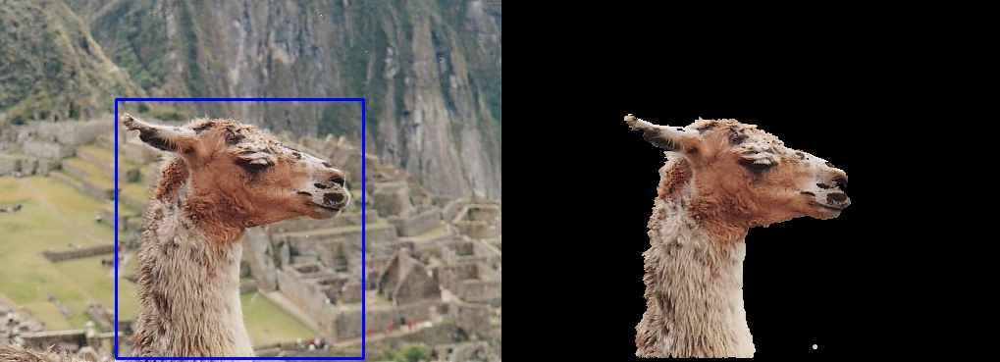

# GrabCut

This software implements major portions of the GrabCut Algorithm <a href="#ref1">\[1\]</a>, a markov random field based image segmentation algorithm, a variant of which you might have seen available in Microsoft Office Products as the background removal tool.



The algorithm is iterative and interactive, and is known for the minimal and simple user interaction required, as well as its ability to fix the results using further iterations of user input.  

The algorithm is based on multiple iterations of GraphCut <a href="#ref2">\[2\]</a>, and uses each iteration to improve its model of the foreground and background color distributions, which are modelled as gaussian mixtures. The notebook explains each step as it is performed. Look at the paper for more details.

*Border matting (Section 4 of <a href="#ref1">\[1\]</a>) is not a part of this implementation.*

## To run
*All commands to be run from the repository root.*  

1. Install python packages from the Python Package Index (preferably in a virtual environment).
   ```(shell)
   python3 -m venv env && source env/bin/activate # optional
   pip install -r requirements.txt
   ```
2. Run the notebook on a jupyter server.
   ```(shell)
   jupyter notebook
   ```
   Open `src/grabcut.ipynb` in the web browser window.

---
<a id="ref1">\[1\]</a> Carsten Rother, Vladimir Kolmogorov, and Andrew Blake. 2004. "GrabCut": interactive foreground extraction using iterated graph cuts. ACM Trans. Graph. 23, 3 (August 2004), 309–314. DOI:https://doi.org/10.1145/1015706.1015720  

<a id="ref2">\[2\]</a> Y. Y. Boykov and M. -. Jolly, "Interactive graph cuts for optimal boundary & region segmentation of objects in N-D images," Proceedings Eighth IEEE International Conference on Computer Vision. ICCV 2001, 2001, pp. 105-112 vol.1, doi: 10.1109/ICCV.2001.937505.